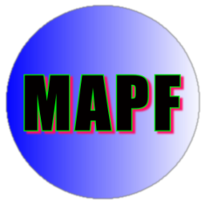

# Macro Advanced Picture Format

* * *

### What is MAPF?

* **MAPF** is an experimental _Image Format_ written in python to encode mostly screenshots or artificially generated graphics, it can be better than jpg and webp.  

### Why MAPF is better than webp/jpg compressing screenshots?
* **MAPF** hasn't block compression algorithm. 
So it doesn't compress image at blocks.

### Which version I should download?

You can download it in different versions...

* **MAPF0.9.9_win64_pyinstaller.zip** - Compiled by pyinstaller MAPF binary for windows *VISTA, 7, 8, 8.1 and 10* - 64 bit. In exe included all possible compressions (external binaries too). Big exe size (~19MB) and not too fast executing.
* **MAPF0.9.9_win64_nuitka_upx.zip** - Compiled by nuitka MAPF binary for windows *VISTA, 7, 8, 8.1 and 10* - 64 bit. In zip included all possible compressions (external binaries too), but you have to extract all of items in archive into one folder. Small exe size (~5MB) and fast executing.
* **MAPF0.9.9_win32_pyinstaller.zip** - Compiled by pyinstaller MAPF binary for windows *VISTA, 7, 8, 8.1 and 10* - 32 bit. In exe included all possible compressions (external binaries too). Big exe size (~19MB) and not too fast executing. *Works on 64bit windows too!* 

* **MAPF0.9.9_win32_nuitka_upx.zip** - Compiled by nuitka MAPF binary for windows *VISTA, 7, 8, 8.1 and 10* - 32 bit. In zip included all possible compressions (external binaries too), but you have to extract all of items in archive into one folder. Small exe size (~3MB) and fast executing. *Works ONLY on 32bit windows platform!* 
* **MAPF-0.9.9.tar.gz** - Source of MAPF, can be installed on windows with python 3. Install via `pip install MAPF-0.9.9.tar.gz`.
* **MAPF0.9.9_win64_compressors.zip** - Only external compressors binaries (bcm.exe, nz.exe) packed into zip file for windows 64bit. (size ~400KB)
* **MAPF0.9.9_win32_compressors.zip** - Only external compressors binaries (bcm.exe, nz.exe) packed into zip file for windows 32bit. (size ~340KB)

### How MAPF compression works?
* **MAPF** in mode 0 a special color space it supports only 2 097 152 colors (not 16 777 216 like in RGB color space).
* Then it runs internal compression... Internal compression convert 24-bit colors into 8 or 16 bit. 
* Some examples:
  * If RGB data is `([50,60,30] [50,60,30])`, internal compression converts it into `([50,60,30] [130])`, 6 bytes --> 4 bytes.
  * If RGB data is `([1,2,3] [2,3,4])`, internal compression converts it into `([1,2,3] [161])`, 6 bytes --> 4 bytes.
  * If RGB data is `([2,0,3] [1,1,4])`, internal compression converts it into `([2,0,3] [170])`, 6 bytes --> 4 bytes.
  * If RGB data is `([0,0,0] [255,0,0])`, internal compression converts it into `([128] [131])`, 6 bytes --> 2 bytes.
  * *etc...*

* And then runs external compression like lzma...

### License
The MIT License (MIT)

Copyright (C) 2018 Aleksander Błażelonis [olokelo]

Permission is hereby granted, free of charge, to any person obtaining a copy
of this software and associated documentation files (the "Software"), to deal
in the Software without restriction, including without limitation the rights
to use, copy, modify, merge, publish, distribute, sublicense, and/or sell
copies of the Software, and to permit persons to whom the Software is
furnished to do so, subject to the following conditions:

The above copyright notice and this permission notice shall be included in all
copies or substantial portions of the Software.

THE SOFTWARE IS PROVIDED "AS IS", WITHOUT WARRANTY OF ANY KIND, EXPRESS OR
IMPLIED, INCLUDING BUT NOT LIMITED TO THE WARRANTIES OF MERCHANTABILITY,
FITNESS FOR A PARTICULAR PURPOSE AND NONINFRINGEMENT. IN NO EVENT SHALL THE
AUTHORS OR COPYRIGHT HOLDERS BE LIABLE FOR ANY CLAIM, DAMAGES OR OTHER
LIABILITY, WHETHER IN AN ACTION OF CONTRACT, TORT OR OTHERWISE, ARISING FROM,
OUT OF OR IN CONNECTION WITH THE SOFTWARE OR THE USE OR OTHER DEALINGS IN THE
SOFTWARE.

### List of image modes in MAPF

<table class="tg">
  <tr>
    <th class="tg-0pky">Image mode</th>
    <th class="tg-0lax">Color depth (bits)</th>
    <th class="tg-c3ow">Internal compression speed (pixels per sec)</th>
    <th class="tg-0pky">Quality range</th>
    <th class="tg-0lax">Maximum color count</th>
    <th class="tg-0pky">Recommended for</th>
    <th class="tg-wgsn">Not recommended for</th>
  </tr>
  <tr>
    <td class="tg-wgsn">Lossy RGB (0)</td>
    <td class="tg-0lax">24</td>
    <td class="tg-0pky">~ 920 000 pps (0,92MP/s)</td>
    <td class="tg-0pky">0-31</td>
    <td class="tg-0lax">2 097 152 (128**3)</td>
    <td class="tg-0pky">Color palettes Landscapes</td>
    <td class="tg-0pky">Big size images Screenshots</td>
  </tr>
  <tr>
    <td class="tg-0pky">Lossy RGBA (1)</td>
    <td class="tg-0lax">32</td>
    <td class="tg-0pky">~ 920 000 pps (0,92MP/s)</td>
    <td class="tg-0pky">0-31</td>
    <td class="tg-0lax">268 435 456 (128**4)</td>
    <td class="tg-0pky">Icons</td>
    <td class="tg-0pky">Big size images Screenshots</td>
  </tr>
  <tr>
    <td class="tg-0pky">Lossless YUV (2)</td>
    <td class="tg-0lax">24</td>
    <td class="tg-0pky">~ 83 253 060 pps (83,2MP/s)</td>
    <td class="tg-0pky">1</td>
    <td class="tg-0lax">16 777 216 (256**3)</td>
    <td class="tg-0pky">Screenshots Compressing raw</td>
    <td class="tg-0pky">Icons</td>
  </tr>
  <tr>
    <td class="tg-0pky">Lossy YUV (3)</td>
    <td class="tg-0lax">From ~9 to 24</td>
    <td class="tg-0pky">With compression helper: ~ 14 464 785 pps (14,5MP/s) Without compression helper: ~ 44 532 678 pps (44.5MP/s) </td>
    <td class="tg-0pky">0-127</td>
    <td class="tg-0lax">11 239 424 (224**3)</td>
    <td class="tg-0pky">Landscapes Screenshots Selfies</td>
    <td class="tg-0pky">Color palettes</td>
  </tr>
  <tr>
    <td class="tg-0pky">Luma/monochrome (4)</td>
    <td class="tg-0lax">8</td>
    <td class="tg-0pky">With compression helper: ~ 4 942 298 (4,9MP/s) Without compression helper: ~ 24 984 686 (25MP/s) </td>
    <td class="tg-0pky">0-31</td>
    <td class="tg-0lax">256</td>
    <td class="tg-0pky">Monochrome fotos</td>
    <td class="tg-0pky">Icons Color palettes</td>
  </tr>
  <tr>
    <td class="tg-0pky">Draft/preview (5)</td>
    <td class="tg-0lax">24</td>
    <td class="tg-0pky">~ 16 874 132 (16,9MP/s)</td>
    <td class="tg-0pky">0-31</td>
    <td class="tg-0lax">262144 (64**3)</td>
    <td class="tg-0pky">Thumbnails from any image</td>
    <td class="tg-0pky">Screenshots Icons</td>
  </tr>
  <tr>
    <td class="tg-0lax">Lossless YUV+A (6)</td>
    <td class="tg-0lax">32</td>
    <td class="tg-0lax">~ 83 253 060 pps (83,2MP/s)</td>
    <td class="tg-0lax">1</td>
    <td class="tg-0lax">4 294 967 296 (256**4)</td>
    <td class="tg-0lax">Icons</td>
    <td class="tg-0lax">Landscapes</td>
  </tr>
  <tr>
    <td class="tg-0lax">Blocking YUV (7)</td>
    <td class="tg-0lax">24</td>
    <td class="tg-0lax">~ 9 222 817 (9,2MP/s) [quality 127] ~ 11 599 003 (11,6MP/s) [quality 0]</td>
    <td class="tg-0lax">0-127</td>
    <td class="tg-0lax">11 239 424 (224**3)</td>
    <td class="tg-0lax">Screenshots</td>
    <td class="tg-0lax">Icons Landscapes</td>
  </tr>
</table>

### List of compression algorithms used in MAPF

<table class="tg">
  <tr>
    <th class="tg-s268">Compression</th>
    <th class="tg-s268">Type</th>
    <th class="tg-s268">Compressed size</th>
    <th class="tg-s268">Compression speed</th>
    <th class="tg-s268">Decompression speed</th>
    <th class="tg-s268">Level range</th>
    <th class="tg-0lax">Author</th>
    <th class="tg-0lax">MAPF identifier</th>
  </tr>
  <tr>
    <td class="tg-s268">LZMA (0)</td>
    <td class="tg-bf1x">Built-in</td>
    <td class="tg-jkgw">Good</td>
    <td class="tg-jkgw">Good</td>
    <td class="tg-jkgw">Good</td>
    <td class="tg-57mh">1-9</td>
    <td class="tg-0lax"><a href="https://en.wikipedia.org/wiki/Igor_Pavlov_(programmer)">Igor Pavlov</a></td>
    <td class="tg-0lax">lzma, xz, lz</td>
  </tr>
  <tr>
    <td class="tg-s268">BZIP2 (1)</td>
    <td class="tg-bf1x">Built-in</td>
    <td class="tg-jkgw">Good</td>
    <td class="tg-f8vr">Weak+</td>
    <td class="tg-jkgw">Good</td>
    <td class="tg-57mh">1-9</td>
    <td class="tg-0lax"><a href="https://en.wikipedia.org/wiki/Julian_Seward">Julian Seward</a></td>
    <td class="tg-0lax">bz2, bzip2</td>
  </tr>
  <tr>
    <td class="tg-s268">NANOZIP (2)</td>
    <td class="tg-0w94">External executable</td>
    <td class="tg-bf1x">The best</td>
    <td class="tg-veep">Weak</td>
    <td class="tg-veep">Weak</td>
    <td class="tg-s268">-</td>
    <td class="tg-0lax"><a href="http://nanozip.ijat.my/">Sami Runsas</a></td>
    <td class="tg-0lax">nano-zip, nanozip, nz, nano_zip</td>
  </tr>
  <tr>
    <td class="tg-s268">BROTLI (3)</td>
    <td class="tg-zuva">External module</td>
    <td class="tg-gx9h">Very good</td>
    <td class="tg-xv1u">The worst</td>
    <td class="tg-jkgw">Good</td>
    <td class="tg-dcf8">1-11</td>
    <td class="tg-0lax"><a href="https://github.com/google/brotli">Google</a></td>
    <td class="tg-0lax">brotli, br</td>
  </tr>
  <tr>
    <td class="tg-s268">ZSTD (4)</td>
    <td class="tg-zuva">External module</td>
    <td class="tg-jkgw">Good</td>
    <td class="tg-jkgw">Good</td>
    <td class="tg-gx9h">Very good</td>
    <td class="tg-8q3b">1-22</td>
    <td class="tg-0lax"><a href="https://github.com/facebook/zstd">Yann Collet (facebook)</a></td>
    <td class="tg-0lax">zstd, zst</td>
  </tr>
  <tr>
    <td class="tg-s268">SNAPPY (5)</td>
    <td class="tg-zuva">External module</td>
    <td class="tg-veep">Weak</td>
    <td class="tg-698l">The best</td>
    <td class="tg-698l">The best</td>
    <td class="tg-s268">-</td>
    <td class="tg-0lax"><a href="https://github.com/google/snappy">Google</a></td>
    <td class="tg-0lax">snappy, sz</td>
  </tr>
  <tr>
    <td class="tg-s268">None (6)</td>
    <td class="tg-bf1x">Built-in</td>
    <td class="tg-s268">-</td>
    <td class="tg-s268">-</td>
    <td class="tg-s268">-</td>
    <td class="tg-s268">-</td>
    <td class="tg-0lax">-</td>
    <td class="tg-0lax">without</td>
  </tr>
  <tr>
    <td class="tg-s268">BCM (7)</td>
    <td class="tg-0w94">External exeutable</td>
    <td class="tg-gx9h">Very good</td>
    <td class="tg-24ep">Good+</td>
    <td class="tg-gx9h">Very good</td>
    <td class="tg-s268">-</td>
    <td class="tg-0lax"><a href="https://github.com/encode84/bcm">Ilya Muravyov</a></td>
    <td class="tg-0lax">bcm</td>
  </tr>
</table>

#### All benchmarks above has made using 3.2GHZ i5 processor 8GB of ram and 64 bit windows 10.

# Command line usage:
* **Encode to MAPF (function save):**
  * **Options:**
    * `-i`, `--input`: Input image path.  In python: _input_path_ <-- str
    * `-d`, `--destination`: Destination of output MAPF image.  In python: _output_path_ <-- str/None
    * `-m`, `--image-mode`: Can be int in range 0-7 or image mode identifier. (see image modes section). Default: 3 (Lossy YUV) In python: _image_mode_ <-- int/str
    * `-cm`, `--compress-mode`: Can be int in range 0-7 or compress mode identifier. (see compress modes section). Default: 0 (LZMA) In python: _compress_mode_ <-- int/str
    * `-cp`, `--compress-power`: Compression power for external compression algorithm. (see compress ranges in compress modes section). Default: 9 In python: _compress_power_ <-- int
    * `-q`, `--quality`: Auto adjusted quality for images. **Warning, sometimes quality isn't correct. Quality is  only hint to image encoder, but for example sometimes image in quality 40 can be smaller than quality 20.** Default: -1 In python: _quality_ <-- int
    * `-s`, `--scalar-quality`: You can adjust image downsampling (and enlarging it in decoding) level. Can be in range 0-3. Default: 3 In python: _quality_scalar_ <-- int
    * `-c`, `--color-quality`: Color palette used in image (less = less colors used in image) can be int in range 0-7. Default: 6 In python: _quality_colors_ <-- int
    * `-y`, `--yuv-quality`: Subsampling quality of image in mode 3. (range 0-15) **Warning, -y below 4 resizes also Y channel, so image is downscaling 2x.** 
    Default: 4 In python: _subsampling_quality_ <-- int
    * `-e`, `--enlarger`: Enlarger used in down/upsampling image. Can be in range 0-3  (0: BICUBIC, 1: BILINEAR, 2: LANCZOS, 3: NEAREST). Default: 2 In python: _enlarger_ <-- int
    * `-nh`, `--no-helper`: Disable compression helper *(disable removing one-pixel obstacles)*. Maybe useful option in very small images or in text compressing.
     In python: _helper_ <-- bool
    * `-hm`, `--helper-max`: Compression helper is written in python, so when it's run it can take a lot of time. Helper max sets maximum data length (in MB), when helper can be used. Default is 8, so helper will run only when length of data < 8MB. In python: _compress_helper_max_ <-- int
    * `-o`, `--optimizer`: Enable optimizer, in mode 0 or 1 enables optimizer algorithm, which helps to compress image.  In python: _optimizer_enabled_ <-- bool
    * `-oc`, `--optimizer-chunk`: Chunk of optimizing pixels. (less is slower) Default is 8.  In python: _optimizer_chunk_ <-- int
    * `-om`, `--optimizer-maxdiff`: Maximum chroma difference between pixels loaded in chunk. Default: 25  In python: _optimizer_maxdiff_ <-- int
    * `-nd`, `--no-debug`: Disable debug info printed to stdout.  In python: _debug_ <-- bool
    * `-bq`, `--quiet`: Disable ANY prints to stdout (warnings and comparsions).
     In python: _quiet_ <-- bool
     
  * *First way:* `MAPF input.{jpg,png,gif,webp,ico,jpeg,tiff,bmp} [options]`
    * Encode input image into input filename merged with *.mapf* extension.
  * *Second way:* `MAPF input.{jpg,png,gif,webp,ico,jpeg,tiff,bmp} output.mapf [options]`
    * Encode input image into output file.
  * *Third way:* `MAPF -i input.xxx -d output.mapf [options]`
    * Encode image from -i into output file from -d.
* **Read from MAPF (function read):**
  * **Options:**
    * `-i`, `--input`: Input MAPF path.  In python: _input_image_ <-- str/_io.BytesIO
    * `-d`, `--destination`: Destination of output image.  In python: _output_image_  <-- str/None
    * `-r`, `--read`: Switch mode to decompress.
    * `-v`, `--view-only`: Use it if you want to only view image.  In python: _showonly_ <-- bool
    * `-nd`, `--no-debug`: Disable debug info printed to stdout.  In python: _debug_ <-- bool
    * `-bq`, `--quiet`: Disable ANY prints to stdout (warnings and comparsions).  In python: _quiet_ <-- bool
  * *First way:* `MAPF input.mapf [options]`
    * Decode image and show it. You can also drag'n drop MAPF file to show it.
  * *Second way:* `MAPF input.mapf output.{jpg,png,gif,webp,ico,jpeg,tiff,bmp} [options]`
    * Decode image and save it to file provided in args.
  * *Third way:* `MAPF -i input.mapf -d output -r [options]`
    * Decode image and save it to file provided in -d.
* **Identify MAPF file (function identify):**
  * `MAPF input.mapf --identify`
    * Displays MAPF image file details (ex. width, height, mode) without reading data.
       In python: _MAPFfile_ <-- str
       In python: _debug_ <-- bool
* **Display version:**
  * `MAPF --version
    * Displays MAPF executable version.* 
     In python: _MAPF.version_ --> str
* **Display compressions:**
  * `MAPF --compressions`
    * Displays MAPF available compressions.
     In python: _avaiable_compressions_ --> dict

# Some examples using MAPF from python:

### Encode image to file:

<pre>from MAPF import MAPF
MAPF.save('input.jpg', 'output.mapf', compress_mode='nz', quality=4, image_mode="YUV", debug=False, quiet=True)
</pre>

### Decode MAPF file into PIL image:

<pre>from MAPF import MAPF
from PIL import Image
im = MAPF.read('output.mapf', showonly=False, debug=False, quiet=True)
im.show()
print(im.size, im.mode)
</pre>

Output: `(1920, 1200) RGB`

### Advanced in-memory usage (without saving to file):

<pre>
from MAPF import MAPF
from PIL import Image
from io import BytesIO

data = save(input_path='input.jpg', compress_mode='nz', image_mode='YUV', quality=4, return_data=True, debug=False, quiet=True)
bio = BytesIO()
bio.write(data)
im = read(bio, showonly=False, debug=False)
im.show()
</pre>

### Identify MAPF Image from python:

<pre>
from MAPF import MAPF
im = MAPF.identify('input.mapf', debug=False)
print(im['width'], im['height'], im['image_mode'], im['compress_mode'])
</pre>

Output: `1920 1200 YCBCR nano-zip`

## MAPF file limitations...

MAPF image resolution is limited by maximum size of integers packed in header...
* In RGB mode: maximum 1 431 655 765 pixels (65535x21845 pixels) [1.43 GigaPixel]
* In RGBA mode: maximum 1 073 741 824 pixels (65535x16384 pixels) [1.07 GigaPixel]
* In Lossless YUV mode: maximum 1 431 655 765 pixels (65535x21845 pixels) [1.43 GigaPixel]
* In YUV mode: maximum 4 294 836 225 pixels (65535x65535 pixels) [4.30 GigaPixel]
* In MONOCHROME mode: maximum 4 294 836 225 pixels (65535x65535 pixels) [4.30 GigaPixel]
* In PREVIEW mode: maximum 1 431 655 765 pixels (65535x21845 pixels) [1.43 GigaPixel]
* In Lossless YUVA mode: maximum 1 073 741 824 pixels (65535x16384 pixels) [1.07 GigaPixel]
* In Block YUV mode: maximum 1 431 655 765 pixels (65535x21845 pixels) [1.43 GigaPixel]

## JPEG VS MAPF (Downscaled 2x)
#### Open image in new tab to view full size
* **Lossy** JPEG example (51.2KB). Converted by PILLOW 5.1.0: `Image.open('ben1.png').convert('RGB').save('ben1.jpg', quality=5)`

 

* **Lossy** MAPF example (50.3KB). `MAPF ben1.png ben1.mapf -cm nz -y 13 -c 4`  And the decoded to png using: `MAPF ben1.mapf ben1_mapf.png`

 
 

## WEBP VS MAPF (Zoomed 2x)
* **Lossy** WEBP example 29.8KB). Converted by PILLOW 5.1.0: `Image.open('ben1.png').convert('RGB').save('ben1.webp', quality=5)`

 

* **Lossy** MAPF example (29.7KB). `MAPF ben1.png ben2.mapf -cm nz -y 10 -c 1 -nh`  And the decoded to png using: `MAPF ben2.mapf ben2_mapf.png`

 

## JPEG VS WEBP VS MAPF (Downscalled 8x)
### All RGB colors in 4096x4096 image

* **Lossy** JPEG example (266KB). Converted by PILLOW 5.1.0: `Image.open('all.png').convert('RGB').save('ben3.jpg', quality=1)`

 

* **Lossy** WEBP example (82.8KB). Converted by PILLOW 5.1.0: `Image.open('all.png').convert('RGB').save('ben3.webp', quality=0)` (then transcoded to high quality jpg, cause PNG generated from WEBP has about 10MB size).

 

* **Lossy** MAPF example (18.0KB). `MAPF all.png ben3.mapf -cm nz -m RGB -s 3 -c 7`  And the decoded to png using: `MAPF ben3.mapf ben3_mapf.png`

 

## JPEG VS WEBP VS MAPF
### Plain text in image

* **Lossy** JPEG example (54.5KB). Converted by PILLOW 5.1.0: `Image.open('randomtext.png').convert('RGB').save('ben4.jpg', quality=1)`

 

* **Lossy** WEBP example (64.5KB). Converted by PILLOW 5.1.0: `Image.open('randomtext.png').convert('RGB').save('ben4.webp', quality=0)`

 

* **Lossy** MAPF example (52.6KB). `MAPF randomtext.png ben4.mapf -cm nz -y 4 -c 5 -nh`  And the decoded to png using: `MAPF ben4.mapf ben4_mapf.png`

 

## JPEG VS WEBP VS MAPF (Downscalled 2x)
### Monochrome image

* **Lossy** JPEG example (16.0KB). Converted by PILLOW 5.1.0: `Image.open('monochrome.jpg').convert('RGB').save('ben5.jpg', quality=1)`

 

* **Lossy** WEBP example (15.7KB). Converted by PILLOW 5.1.0: `Image.open('monochrome.jpg').convert('RGB').save('ben5.webp', quality=5)`

 

* **Lossy** MAPF example (15.2KB). `MAPF monochrome.jpg ben5.mapf -cm nz -m luma -s 2 -c 0`  And the decoded to png using: `MAPF ben5.mapf ben5_mapf.png`

 

## PNG VS WEBP VS MAPF
### Lossless icon compression with alpha

* **Lossless** PNG example (18.8KB).

 

* **Lossless** WEBP example (13.4KB). Converted by PILLOW 5.1.0: `Image.open('logov.png').save('ben6.webp', lossless=1)`

 

* **Lossless** MAPF example (12.9KB). `MAPF logov.png ben6.mapf -cm nz -m lossless_yuva`  And the decoded to png using: `MAPF ben6.mapf ben6_mapf.png`

 

## WEBP VS MAPF
### Lossless image compression

* **Lossless** WEBP example (1.15MB). Converted by PILLOW 5.1.0: `Image.open('jpgtest.jpg').convert('RGB').save('ben7.webp', lossless=1)`

 

* **Lossless** MAPF example (1.0MB). `MAPF jpgtest.jpg ben7.mapf -cm nz -m lossless_yuv`  And the decoded to png using: `MAPF ben6.mapf ben7_mapf.png`

 

## MAPF PREVIEW MODE

* **MAPF** can also create thumbnails from images. `MAPF thumb.jpeg thumb.mapf -m preview -s 1 -c 3 -cm nz`
* **MAPF** thumbnail example (only 445 bytes of data)

 

* Made from 34.5 kilobytes JPEG image, shown below...

 

## MAPF DOESN'T SUPPORT ANIMATIONS (YET) BUT I'LL TRY TO ADD IT IN NEXT VERSIONS ;)